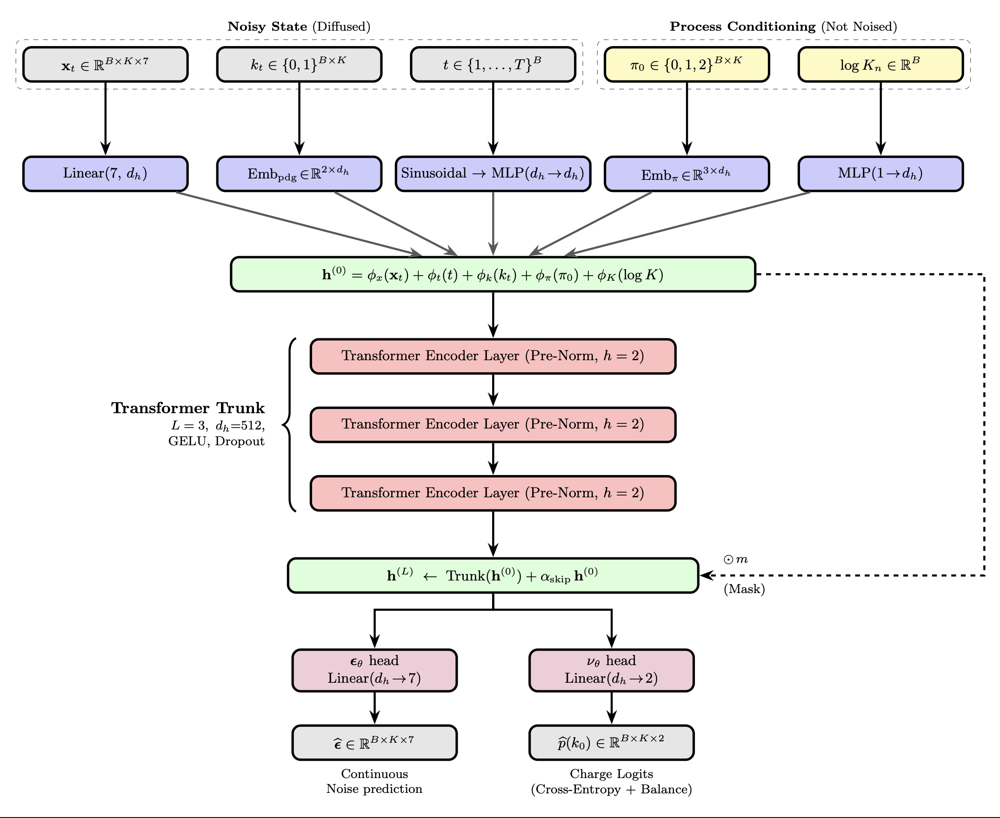

# D $e^+e^-$ fusion: Capturing the Beam-Beam Physics of $e^+e^-$ Collisions with Diffusion Models

<p align="center">
  
</p>

## Overview

This is the official GitHub repository accompanying the manuscript 'D $e^+e^-$ fusion: Capturing the Beam-Beam Physics of $e^+e^-$ Collisions with Diffusion Models'. D $e^+e^-$ fusion is a transformer-based denoising diffusion probabilistic model (DDPM)
for generating **beam-induced background (BIB)** particles at the FCC-ee. Each
collision produces a variable-length set of soft electrons/positrons
(incoherent pair background, e.g. from `GuineaPig++`), and **D $e^+e^-$ ffusion** learns to
generate the full per-event particle set in one shot, conditioned on the event
multiplicity and the per-event process composition. The trained model generates events nearly four orders of magnitude faster than `GuineaPig++`, paving the way for a fast-simulation surrogate for FCC-ee design studies.

## Methods

Each particle is represented by 7 continuous features plus two discrete labels:

| Symbol | Quantity | Treatment |
| --- | --- | --- |
| `log\|E\|` | log energy | continuous (Gaussian DDPM) |
| `u_x, u_y, u_z` | unsquashed velocity (`arctanh` of $\beta$) | continuous (Gaussian DDPM) |
| `x, y, z` | position | continuous (Gaussian DDPM) |
| `pdg` | charge ∈ {$e^+, e^-$} | discrete uniform-flip diffusion |
| `process` | physics process ∈ {0, 1, 2} | never noised |

The velocity components are mapped through an `arctanh`/`tanh` "unsquash /
squash" pair so the model operates in an unbounded space while generated
velocities always satisfy $|\beta| < 1$.


## Repository Layout

| File | Contents |
| --- | --- |
| `main.py` | CLI entry point (`train` / `sample` sub-commands), fault handlers |
| `config.py` | `CFG` dataclass with all hyper-parameters and defaults |
| `dataset.py` | `MCPDataset` — loads `.npy` events, builds the 7-feature representation |
| `model.py` | `ParticleDenoiser` transformer + `SinusoidalTimeEmbedding` |
| `diffusion.py` | cosine $\beta$-schedule, discrete pdg-flip schedule, `DDPM` wrapper |
| `losses.py` | inverse-freq diffusion MSE, charge cross-entropy, charge-balance |
| `train.py` | training/validation loop with auto-resume and checkpointing |
| `sample.py` | checkpoint loading, reverse diffusion, physical-unit decoding |

## Data Format

Training data is a single `.npy` object array of events. Each event is an
`(N, ≥8)` float array with columns:

```
[E_signed, betax, betay, betaz, x, y, z, process]
```

- `E_signed` — energy whose **sign encodes the charge** ($\ge 0 \to e^+$, $\le 0 \to e^+-$).
- `betax, betay, betaz` — velocity components ($|\beta| < 1$).
- `x, y, z` — particle position.
- `process` — integer physics-process label in `{0, 1, 2}`.

## Installation

```bash
pip install -r requirements.txt
```

Requires Python ≥ 3.10 (the codebase uses `float | None` type hints) and a
CUDA-capable GPU for training.

## Usage

1. **Train the model**:

```bash
python main.py train \
  --data_path /path/to/events.npy \
  --outdir ./runs/bibdm_exp1 \
  --epochs 50 \
  --batch_size 2
```

Training writes the following into `--outdir`:
- `meta.pt` — normalisation stats, multiplicities, per-event process
  composition, model hyper-parameters and the train/val split (everything
  needed to sample later).
- `ckpt_last.pt` — latest model/optimiser/scheduler state.
- `train_losses.npy`, `val_losses.npy` — per-epoch loss curves.

Add `--resume` to continue from `outdir/ckpt_last.pt` (the split is restored
from `meta.pt` so train/val never leak across restarts).

2. **Generate synthetic events**:

```bash
python main.py sample \
  --outdir ./runs/bibdm_exp1 \
  --n_events 3000 \
  --num_steps 250 \
  --clip_x_norm 10.0
```

This writes `generated_events_<num_steps>steps.npy` into `--outdir`: an object
array of `(K_i, 9)` events with columns

```
[pdg, E, betax, betay, betaz, x, y, z, process]
```

Omit `--num_steps` to run all `T` reverse-diffusion steps.


## Command-Line Arguments

### `train`
```
--data_path        Path to training data (.npy)
--outdir           Output directory (checkpoints, meta, loss curves)
--max_particles    Max particles per event (default: 1300)
--epochs           Number of epochs (default: 50)
--batch_size       Batch size (default: 2)
--T                Diffusion steps (default: 1000)
--seed             Random seed (default: 123)
--resume           Resume from outdir/ckpt_last.pt if it exists
```

### `sample`
```
--outdir             Trained run directory (must contain meta.pt + ckpt_last.pt)
--n_events           Number of events to generate (default: 3000)
--sample_batch_size  Events per reverse-diffusion batch (default: 1)
--num_steps          Reverse-diffusion steps (default: all T)
--clip_x_norm        Clamp the normalised state at ±this many sigma each step
                     to suppress heavy-tail outliers; 0 disables (default: 10.0)
```

All other hyper-parameters (model size, learning rate, loss weights, noise
schedule, ...) live in `config.py`.

## Dependencies

- pytorch
- numpy
- matplotlib
- tqdm

